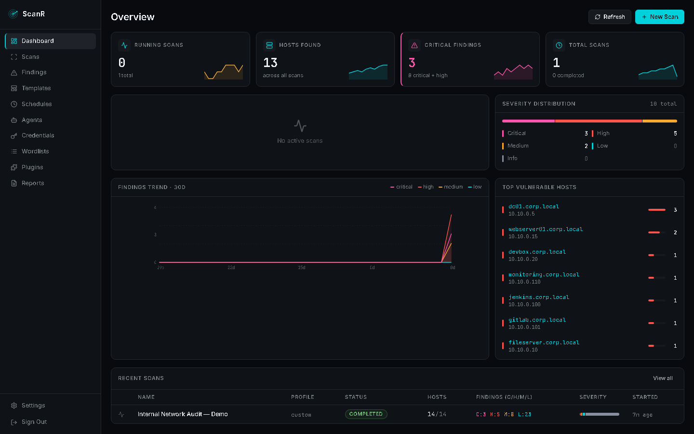
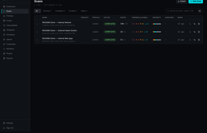
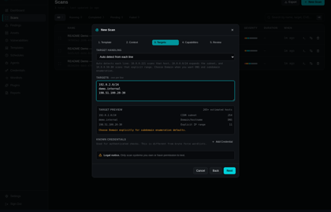
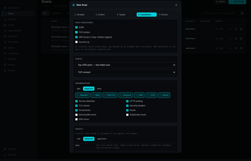
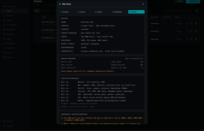
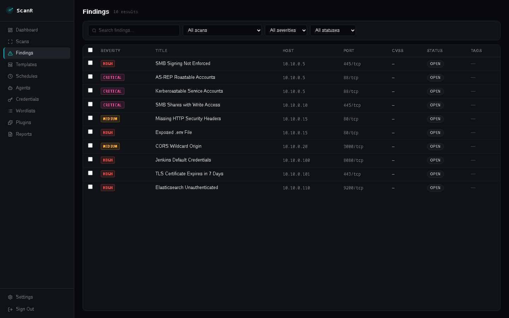
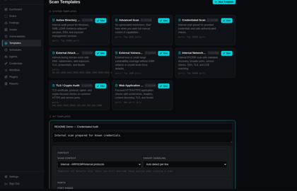
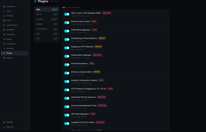
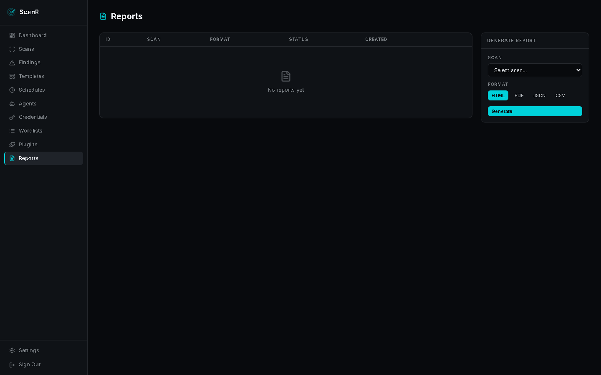
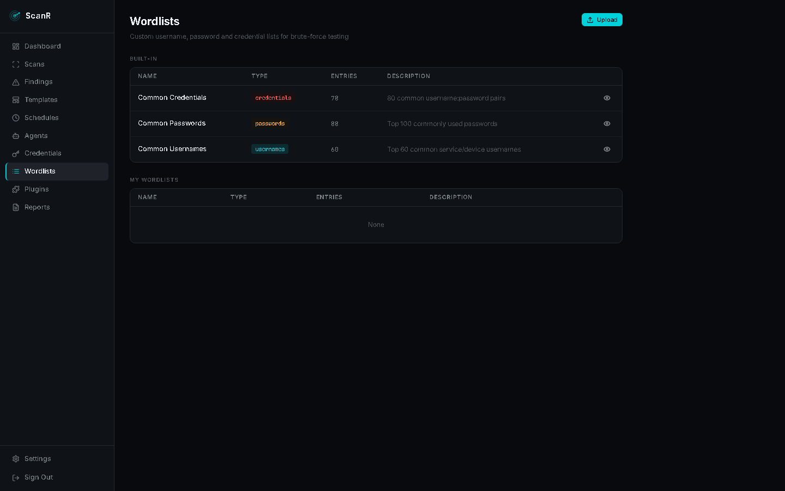

> This project was built with the assistance of AI.

# ScanR

ScanR is a self-hosted vulnerability scanner for authorized internal and external security testing. It combines template-assisted scan setup with capability-level controls, live scan telemetry, structured findings, screenshots, reports, and recurring scan workflows.

> **Legal notice:** Only scan networks and systems you own or have explicit written permission to test. Unauthorized scanning is illegal.

---



## Highlights

- **Template-assisted scanning** - start from intent-based presets, then tune the actual capabilities.
- **Context-aware targets** - internal, external, or custom context with automatic target handling for IPs, CIDR blocks, IP ranges, hostnames, and domains.
- **Capability controls** - discovery, ports, service/web enumeration, depth, safety, and performance are exposed directly.
- **Nmap, masscan, Nuclei, and native plugins** - host discovery, port scanning, service detection, CVE checks, web checks, TLS checks, and service misconfiguration checks.
- **Live console and persisted history** - stream scan progress while the scan runs and replay it later.
- **Findings triage** - false positive, accepted risk, analyst notes, compliance tags, MITRE ATT&CK tags, and evidence.
- **Peer-review evidence** - findings can include command/probe evidence so another tester can validate the result.
- **Screenshots** - Playwright captures discovered web services when enabled.
- **Scan deltas** - compare scans to see new, resolved, and persisting findings, plus host/port changes.
- **Templates and schedules** - save reusable scan profiles and run them on a schedule.
- **Reports** - export executive and technical reports in multiple formats.
- **API keys, webhooks, and agents** - integrate ScanR into automated workflows and scan from different network vantage points.
- **AI assist (optional)** - LLM-generated findings summaries today, with report narrative, false-positive testing, and autonomous modes on the roadmap. Bring your own ChatGPT, DeepSeek, or Anthropic key.

## Screenshots

### Scan Management



### New Scan Flow

Targets are previewed before launch so a tester can see how ScanR interprets each line.



Capabilities are grouped by discovery, ports, enumeration, safety, and performance.



The review step summarizes scope, selected capabilities, credentials, warnings, and skipped/conditional checks before creating a pending scan.



### Findings



### Templates

Templates are presets, not hard modes. Users can edit context, target handling, ports, discovery, enumeration, safety, and performance before launch.



### Plugins, Reports, and Wordlists







All screenshots above use documentation-safe mock data such as `192.0.2.x`, `198.51.100.x`, `example.com`, and `demo.internal`.

---

## Quick Start

### Prerequisites

- Docker Engine 24+
- Docker Compose v2 (`docker compose`)
- Ports `80` and `8000` available on the host

### 1. Clone

```bash
git clone https://github.com/T3rr0or/ScanR.git
cd ScanR
```

### 2. Configure

```bash
cp .env.example .env
```

Edit `.env` and set required secrets:

```env
# Generate with:
# python3 -c "import secrets; print(secrets.token_urlsafe(32))"
SECRET_KEY=

# Generate with:
# python3 -c "from cryptography.fernet import Fernet; print(Fernet.generate_key().decode())"
VAULT_KEY=

POSTGRES_PASSWORD=

ADMIN_EMAIL=admin@example.com
ADMIN_PASSWORD=
```

ScanR refuses to start if `SECRET_KEY`, `ADMIN_PASSWORD`, or `POSTGRES_PASSWORD` are missing.

### 3. Start

```bash
docker compose up -d
```

Services:

- **frontend** - React/Vite app served by Nginx on port `80`
- **api** - FastAPI backend on port `8000`
- **worker** - Celery scanner worker
- **postgres** - application database
- **redis** - task queue, result backend, and event bus

First boot runs migrations and seeds system templates/plugins.

For local development from source, use `docker compose up -d --build`.

### 4. Open

Open **http://localhost** and log in with the admin credentials from `.env`.

---

## Scan Workflow

### 1. Pick a Template

Templates are entry points only. They preconfigure options but do not hide or lock capabilities.

Common template intents:

- **External Attack Surface** - domains, DNS, subdomains, and web exposure.
- **Web Application Scan** - HTTP/HTTPS ports, headers, screenshots, Nuclei, and web checks.
- **External Vulnerability Scan** - internet-facing hosts with TCP-based discovery defaults.
- **Internal Network Scan** - internal CIDR/range discovery and service enumeration.
- **Credentialed Scan** - internal scan prepared for supplied credentials.
- **Active Directory / Internal Audit** - Windows and internal service-oriented checks.
- **TLS / Crypto Audit** - certificates, protocols, ciphers, and TLS findings.
- **Advanced Scan** - minimal assumptions, full manual control.

### 2. Set Context

`scan_context` sets defaults only:

- **Internal** - deeper enumeration, internal protocols, ICMP/ARP-style intent, and internal service defaults.
- **External** - avoids ICMP reliance, uses TCP/DNS/web-focused defaults.
- **Custom** - neutral defaults with all controls editable.

### 3. Enter Targets

Target handling defaults to **Auto detect from each line**:

| Input | Meaning |
|---|---|
| `192.0.2.24` | one exact IP host |
| `192.0.2.0/24` | CIDR subnet |
| `192.0.2.50-80` | explicit IP range |
| `demo.internal` | hostname |
| `example.com` | domain/hostname; choose Domain for DNS/subdomain workflows |

ScanR shows a target preview with estimated host counts before the scan is created.

### 4. Tune Capabilities

Capability groups:

- **Host Discovery** - ICMP, TCP probes, ARP intent, assume-up behavior, retries, and discovery strategy.
- **Ports** - top ports, full range, web ports, internal high web/NodePort preset, custom ranges, scanner type.
- **Enumeration** - service detection, HTTP probing, TLS checks, security headers, screenshots, Nuclei, directory enumeration, subdomains, DNS recon.
- **Depth** - light, balanced, or deep.
- **Safety** - safe, balanced, or aggressive.
- **Performance** - conservative, normal, fast, or custom concurrency/rate/timeout settings.

### 5. Review and Launch

The final review step shows:

- interpreted targets and estimated host count
- context and target handling
- selected ports and discovery methods
- safety, depth, and performance
- known credentials and brute-force status
- enabled capability groups
- warnings and skipped/conditional checks

Creating a scan produces a **pending** scan. Review it, then launch it from the Scans table.

---

## Results and Triage

Open a scan to review:

- **Console** - live scan stream and persisted history.
- **Findings** - sortable/filterable findings with severity, host, port, plugin, evidence, remediation, compliance, and MITRE tags.
- **Hosts** - discovered hosts, open ports, service versions, and OS guesses.
- **Topology** - network visualization.
- **Screenshots** - web screenshots captured by Playwright.
- **Chains** - relationship view for correlated findings where available.

Triage actions:

- mark false positive
- accept risk
- add analyst notes
- track remediation status
- compare against previous scans to identify new/resolved findings

---

## Plugin Categories

| Category | Examples |
|---|---|
| Web | HTTP headers, CORS, clickjacking, directory brute-force, sensitive files, open redirect, path traversal, JWT, GraphQL, screenshots |
| SSL/TLS | Certificate inspection, cipher audit, protocol checks, Heartbleed, POODLE/BEAST |
| SSH | Algorithm audit, version fingerprinting, default credential checks |
| Services | FTP, SMB, SNMP, Redis, MongoDB, Elasticsearch, Docker, Kubernetes, Jupyter, IPMI, NTP, VNC, Telnet, RDP |
| Network | Host/port inventory, ICMP information, NetBIOS |
| CVE | NVD-based matching against detected product/version data |
| Nuclei | ProjectDiscovery Nuclei templates for CVEs, exposures, misconfigurations, and default logins |

---

## Credentials and Wordlists

ScanR separates credential concepts:

- **Known credentials** are supplied to authenticated checks.
- **Brute force wordlists** actively try username/password lists against detected services when enabled.

Aggressive safety allows intrusive checks, but brute force still requires the brute-force capability to be enabled explicitly.

---

## Reports

Reports can include:

- executive summary
- affected assets
- severity breakdown
- full finding details
- evidence and remediation
- compliance tags
- analyst notes

Supported exports include HTML, PDF, JSON, CSV, and SARIF where configured.

---

## AI features

ScanR can use an LLM to augment a scan. AI is **off unless you configure a
provider key**. Enter a key two ways:

- **In the web app** (recommended): **Settings → AI** — paste a key for
  Anthropic, OpenAI, or DeepSeek and pick the default provider. Keys are
  encrypted at rest (Fernet, requires `VAULT_KEY`) and never shown again.
- **Via environment**: set `ANTHROPIC_API_KEY`, `OPENAI_API_KEY`, or
  `DEEPSEEK_API_KEY` and `AI_PROVIDER`. A key entered in the web app overrides
  the environment value.

The Docker image bundles the provider SDKs; for a source install add the AI
extra (`pip install -e "backend[ai]"`). The base install runs fine without them.

**Available now (assist mode — read-only):** open a scan and use the **AI** tab,
or call the API directly.

- **Findings summary** - executive + technical narrative of a scan's findings:
  `POST /api/v1/scans/{scan_id}/summary`.
- **Report narrative** - structured engagement-report sections (executive
  summary, risk assessment, key findings, prioritized remediation):
  `POST /api/v1/scans/{scan_id}/report`.
- **False-positive testing** - the model reviews each finding's evidence and
  flags the ones likely to be false positives, with confidence and a reason, for
  analyst review (nothing is auto-hidden):
  `POST /api/v1/scans/{scan_id}/false-positives`.

`GET /api/v1/ai/status` reports which providers are configured.

Assist mode only reasons over results ScanR already collected — it never sends
new traffic to your targets, and finding text is passed to the model as fenced,
untrusted data (never as instructions).

### AI agent (guided / autonomous)

The scan's **AI** tab can run an **agent** that actively investigates the
scan: it drives a bounded, gated tool set, reasons about what it finds, and
writes a prioritized assessment. Launch it with an optional objective and a mode:

- **Guided** — investigates and pauses for operator approval before any
  intrusive action; the run surfaces the pending action with Approve / Deny in
  the AI tab (decision signalled to the running agent, which times out to deny).
- **Autonomous** — runs hands-off within scope, capability, and budget limits.

**Use AI during the scan.** You can also enable the agent when *creating* a
scan ("Use AI during this scan", with mode/objective and admin-gated aggressive
opt-ins). The scan engine then runs the agent at the enumeration phase boundary
— once hosts, services, and findings exist — so the AI performs high-value
follow-up checks (targeted plugins / port scans) that become part of the scan,
rather than requiring a manual launch afterward. The same safety gating applies.

Safety is enforced in code, not by the model: every tool call is scope-checked
(`is_forbidden_target` blocks loopback / link-local / metadata / scanner infra),
aggressive capabilities each require their own opt-in, the run has a token +
iteration budget, and every action is streamed to the scan console and persisted.

The AI tab exposes the run's limits directly — **Max steps** (reasoning
iterations) and **Max tokens** (safety cap) — and a **Stop** button cancels an
in-flight run after its current step, keeping the partial transcript. Reaching
either limit ends the run cleanly and is labelled as such (e.g. "Reached step
limit").

Tools available to the agent today: read the scan's hosts/findings/evidence,
`fetch_url` (HTTP GET, non-intrusive), `list_plugins`, `run_plugin` (run a ScanR
plugin against a discovered host), and `run_port_scan` (nmap a host). Active
tools are intrusive, so they are approval-gated in guided mode.

**Aggressive capabilities** (admin-only opt-in at launch): enabling *aggressive*
unlocks intrusive/destructive actions; *allow exploitation* lets the agent run
destructive plugins via `run_plugin`, and *allow privilege escalation* is a
further opt-in. Each takes effect only with aggressive enabled, requires an
admin user, and is recorded on the run. Only use against systems you are
authorized to actively exploit.

`POST /api/v1/ai/scans/{scan_id}/agent` launches a run;
`GET /api/v1/ai/scans/{scan_id}/agent/runs` and `GET /api/v1/ai/agent/runs/{id}`
read them.

The autonomy levels (`off → assist → guided → autonomous → autonomous +
aggressive`) and the full safety model are documented in
[`docs/ai-pentest-design.md`](docs/ai-pentest-design.md).

Providers are swappable per request (ChatGPT/OpenAI, DeepSeek, Anthropic), so
you can run a cheap model for high-volume work and a stronger one for analysis.

### AI command-execution sandbox (optional)

By default the agent is limited to ScanR's built-in tools. You can optionally
give it a real shell — `run_command` — that runs inside an isolated, disposable
container so it can use the full pentest toolkit and adapt like an operator.
This is **off** unless you opt in with the sandbox Compose overlay.

**Enable it:**

```bash
# 1. Set a shared worker ↔ runner token in .env (do NOT leave it empty)
echo "SANDBOX_TOKEN=$(openssl rand -hex 32)" >> .env

# 2. Tell Compose to always include the sandbox overlay (see warning below),
#    then bring the stack up (images are pulled from GHCR automatically)
echo "COMPOSE_FILE=docker-compose.yml:docker-compose.sandbox.yml" >> .env
docker compose up -d
```

> ⚠️ **Don't lose the sandbox on the next deploy.** The sandbox services live in
> a separate overlay file (`docker-compose.sandbox.yml`). If you bring the stack
> up *without* that overlay — e.g. a plain `docker compose up -d` — Compose
> recreates `api` and `worker` **without** `SANDBOX_RUNNER_URL`, silently
> disabling `run_command` (it returns "sandbox not configured") while the runner
> container keeps running. Setting `COMPOSE_FILE` in `.env` (step 2) makes every
> `docker compose` command include the overlay automatically, so this can't
> happen. The alternative is to pass `-f docker-compose.yml -f
> docker-compose.sandbox.yml` on **every** command.

**Verify it's active:** `docker compose exec worker printenv SANDBOX_RUNNER_URL`
should print `http://sandbox-runner:8090`. In a scan's **AI** tab the agent's
`run_command` calls then execute instead of returning "sandbox not configured".

**Disable it:** remove the `COMPOSE_FILE` line from `.env` (or stop passing the
overlay) and `docker compose up -d`. Command execution returns to fail-closed.

Isolation model: only a dedicated **sandbox-runner** holds the Docker socket and
it carries **no ScanR secrets**; the secret-holding worker can't touch the
socket. The agent gets **one persistent, hardened container per run** (state
persists across commands) that is non-root, read-only-rootfs, `cap-drop ALL`,
and resource/time-limited. Egress is restricted to the scan's authorized targets
plus allowlisted package mirrors, and the path is **fail-closed** — if the runner
is unavailable, command execution is denied. `run_command` requires admin +
the aggressive `allow_command_exec` opt-in. Strict per-target L3 egress requires
a host firewall and must be validated on your deployment. Full architecture:
[`docs/ai-sandbox-design.md`](docs/ai-sandbox-design.md).

---

## Scheduled Scans

Use **Schedules** to run recurring scans from saved templates. Schedules use cron syntax, for example:

```text
0 2 * * 0
```

That example runs weekly at 02:00.

---

## API Access

Create an API key in **Settings** and call the API:

```bash
curl -H "X-API-Key: sk_..." http://localhost:8000/api/v1/scans
```

Create a pending scan:

```bash
curl -X POST http://localhost:8000/api/v1/scans \
  -H "X-API-Key: sk_..." \
  -H "Content-Type: application/json" \
  -d '{
    "name": "Internal review",
    "targets": ["192.0.2.0/24"],
    "profile": "custom",
    "profile_json": "{\"scan_context\":\"internal\",\"port_range\":\"top-1000\"}"
  }'
```

API docs are available at **http://localhost:8000/docs**.

---

## Configuration

| Variable | Default | Description |
|---|---:|---|
| `SECRET_KEY` | required | JWT signing secret |
| `VAULT_KEY` | optional | Fernet key for credential vault encryption |
| `POSTGRES_PASSWORD` | required | PostgreSQL password |
| `ADMIN_EMAIL` | `admin@scanr.local` | Bootstrap admin email |
| `ADMIN_PASSWORD` | required | Bootstrap admin password |
| `ALLOWED_ORIGINS` | `http://localhost` | Comma-separated CORS origins |
| `SECURE_COOKIES` | `true` | Mark auth cookies as secure |
| `TRUSTED_PROXIES` | empty | Comma-separated proxy IPs/CIDRs allowed to set `X-Forwarded-For` for rate limiting |
| `SCAN_TARGET_DENYLIST` | infra defaults | Hostnames/IPs that can never be scanned (merged with built-in loopback/link-local/metadata denylist) |
| `SCAN_HEARTBEAT_TIMEOUT` | `300` | Seconds before a heartbeat-stale running scan is auto-failed |
| `AI_PROVIDER` | `anthropic` | Default AI provider: `anthropic`, `openai`, or `deepseek` |
| `AI_MODEL` | provider default | Override the model id used for AI features |
| `AI_MAX_TOKENS` | `2048` | Max output tokens per AI request |
| `ANTHROPIC_API_KEY` | empty | Key for the Anthropic provider (enables AI when set) |
| `OPENAI_API_KEY` | empty | Key for the OpenAI/ChatGPT provider |
| `DEEPSEEK_API_KEY` | empty | Key for the DeepSeek provider |
| `SANDBOX_RUNNER_URL` | empty | URL of the sandbox-runner; enables the agent's `run_command` shell when set (fail-closed if unset) |
| `SANDBOX_TOKEN` | empty | Shared token authenticating the worker to the sandbox-runner |
| `SANDBOX_IMAGE` | `ghcr.io/t3rr0or/scanr-sandbox:latest` | Toolkit image the sandbox runs |
| `SANDBOX_CMD_TIMEOUT` | `120` | Per-command timeout (seconds) in the sandbox |
| `DATABASE_URL` | compose-managed | SQLAlchemy database URL |
| `REDIS_URL` | compose-managed | Redis URL |
| `CELERY_BROKER_URL` | compose-managed | Celery broker URL |
| `CELERY_RESULT_BACKEND` | compose-managed | Celery result backend |
| `WORDLIST_DIR` | `/app/wordlists` | Wordlist storage path |
| `SELF_UPDATE_ENABLED` | `false` | Enables admin-only in-app update when using the self-update Compose override |
| `SELF_UPDATE_COMMAND` | compose pull/up | Command run by the self-update action |
| `SELF_UPDATE_WORKDIR` | `/opt/scanr` | Directory where the self-update command runs |

---

## Architecture

```text
Browser
  |
  | HTTP / WebSocket
  v
Nginx frontend
  |
  v
FastAPI backend
  |-- PostgreSQL: scans, hosts, ports, findings, reports
  |-- Redis: Celery broker, result backend, live events
  |
  v
Celery worker
  |-- nmap / masscan
  |-- Nuclei
  |-- Playwright
  |-- native Python plugins
```

---

## Updating

For normal Docker installs:

```bash
docker compose pull
docker compose up -d
```

If you use the sandbox or self-update overlays, set `COMPOSE_FILE` in `.env`
(see the [sandbox section](#ai-command-execution-sandbox-optional)) and the same
commands automatically include all needed services.
Database migrations run automatically on API startup.

Admins can optionally enable in-app updates by setting `COMPOSE_FILE=docker-compose.yml:docker-compose.self-update.yml` in `.env` and `SELF_UPDATE_ENABLED=true`. Then start with:

```bash
docker compose up -d
```

(Or combine with the sandbox:
`COMPOSE_FILE=docker-compose.yml:docker-compose.sandbox.yml:docker-compose.self-update.yml`)

This enables the **Update now** button when a newer GitHub release is available. The override mounts the host Docker socket and project directory into the API container, so only use it for trusted admin-only deployments. The default `docker-compose.yml` does not mount the Docker socket.

---

## Stopping

```bash
# Stop containers and keep data
docker compose down

# Stop and delete all ScanR data
docker compose down -v
```

---
