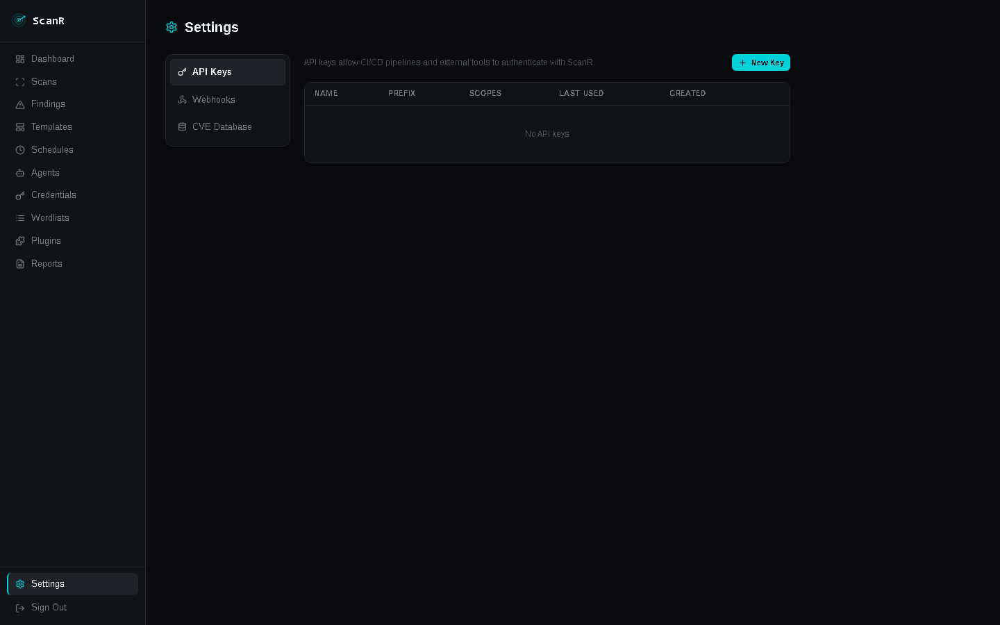

> This project was built with the assistance of [Claude](https://claude.ai) (Anthropic AI).

# ScanR

A self-hosted network vulnerability scanner. Point it at a subnet, get a structured report of open ports, misconfigurations, and CVEs — with a live console, network topology map, and PDF export.

> **Legal notice:** Only scan networks and systems you own or have explicit written permission to test. Unauthorized scanning is illegal.

---


## Features

- **Nmap-based host discovery** and port scanning
- **50+ security plugins** across web, SSH, SSL/TLS, services, and network categories
- **Live scan console** with real-time streaming (persisted — replayable after scan completes)
- **Findings triage** — mark false positives, accepted risk, add analyst notes
- **Network topology map** — D3 force-directed graph, colored by severity
- **Scan comparison (delta)** — diff two scans: new/resolved/persisting findings, host and port changes
- **Screenshot gallery** — automatic Playwright screenshots of discovered web services
- **PDF reports** — executive summary + full findings export
- **Scan templates** — save and reuse scan profiles (Quick, Full, Web Audit, or custom)
- **Scheduled scans** — cron-based recurring scans
- **API keys** — machine-readable access for CI/CD pipelines
- **Webhooks** — notify external systems on scan completion or critical findings
- **Distributed agents** — run scans from multiple network vantage points
- **Nuclei integration** — runs Nuclei templates alongside native plugins


### Plugin categories

| Category | Plugins |
|---|---|
| Web | HTTP headers, CORS, clickjacking, directory brute-force, sensitive files, open redirect, path traversal, JWT misconfig, GraphQL introspection, screenshots |
| SSL/TLS | Certificate inspection, cipher audit, protocol check, Heartbleed, POODLE/BEAST |
| SSH | Algorithm audit, version fingerprint, default credentials |
| Services | FTP anon, SMB signing/vulns, SNMP community strings, Redis/MongoDB/Elasticsearch/Docker/Kubernetes/Jupyter unauthenticated access, IPMI cipher zero, NTP monlist, VNC auth, Telnet, RDP |
| Network | ICMP info, open ports summary, NetBIOS |
| CVE | NVD-based CVE matching against detected service versions |
| Nuclei | Runs Nuclei template library (CVEs, exposures, misconfigs, default logins) |




---

## Quick Start (Docker)

### Prerequisites

- Docker Engine 24+
- Docker Compose v2 (`docker compose` command)
- Ports 80 and 8000 available on the host

### 1. Clone the repository

```bash
git clone https://github.com/T3rr0or/ScanR.git
cd ScanR
```

### 2. Configure environment

```bash
cp .env.example .env
```

Edit `.env` and fill in the required values:

```env
# Generate with: python3 -c "import secrets; print(secrets.token_urlsafe(32))"
SECRET_KEY=

# Generate with: python3 -c "from cryptography.fernet import Fernet; print(Fernet.generate_key().decode())"
VAULT_KEY=

# PostgreSQL password
POSTGRES_PASSWORD=

# Admin account (created on first boot)
ADMIN_EMAIL=admin@example.com
ADMIN_PASSWORD=
```

The application will refuse to start if `SECRET_KEY`, `ADMIN_PASSWORD`, or `POSTGRES_PASSWORD` are not set.

### 3. Start all services

```bash
docker compose up -d --build
```

This starts:
- **postgres** — database
- **redis** — task queue and event bus
- **api** — FastAPI backend on port 8000
- **worker** — Celery scan worker (requires `NET_RAW` / `NET_ADMIN` for nmap)
- **frontend** — Nginx serving the React UI on port 80

First boot runs database migrations and seeds system scan templates automatically.

### 4. Open the UI

Navigate to **http://localhost** and log in with the admin credentials you set in `.env`.

---

## Usage

### Creating a scan

1. Go to **Scans → New Scan**
2. Pick a template (Quick, Full, Web Audit) or configure manually
3. Enter targets — one per line, supports:
   - Single IP: `192.168.1.10`
   - CIDR range: `192.168.1.0/24`
   - IP range: `10.0.0.1-10.0.0.50`
   - Hostname: `example.com`
4. Click **Create & Launch**

### Scan profiles

| Template | Ports | Plugins |
|---|---|---|
| Quick Scan | Top 1 000 | No brute-force, no auth |
| Full Scan | All 65 535 | All plugins |
| Web Audit | 80, 443, 8080, 8443 | Web + SSL only |
| Custom | Your choice | Your choice |

### Viewing results

Open any scan row to enter the scan detail view:

- **Console** — live log stream during scan; full history on completed scans
- **Findings** — sortable/filterable vulnerability table with triage controls
- **Hosts** — discovered hosts with open ports and services
- **Topology** — D3 force-directed network map colored by severity; scroll to zoom, drag to pan
- **Screenshots** — gallery of web service screenshots captured by Playwright

### Findings triage

- Click any finding row to open the detail drawer
- Use **False Positive** / **Accept Risk** buttons in the drawer
- Add analyst notes (auto-saved on blur)
- Filter by triage status: All / Open / False Positive / Accepted Risk

### Comparing scans

On the Scans list, click the **⎇ Compare** icon on any completed scan to open the delta view. Select a baseline scan to see:
- New findings introduced since baseline
- Resolved findings
- Persisting findings
- New/removed hosts
- Per-host port changes

### Reports

Go to **Reports → Generate** to export a report for any completed scan in HTML, PDF, JSON, or CSV format. Includes executive summary, severity breakdown, and full findings list.

### Scheduled scans

Go to **Schedules** to create recurring scans using cron syntax (e.g., `0 2 * * 0` for weekly at 2 AM).

### API access

Go to **Settings → API Keys** to generate a key for automated access:

```bash
# List scans
curl -H "X-API-Key: sk_..." http://localhost:8000/api/v1/scans

# Trigger a scan
curl -X POST -H "X-API-Key: sk_..." -H "Content-Type: application/json" \
  -d '{"name":"CI scan","targets":["10.0.1.0/24"],"profile":"custom","profile_json":"{}"}' \
  http://localhost:8000/api/v1/scans
```

Full API docs: **http://localhost:8000/api/v1/docs**

---

## Configuration reference

All options can be set via `.env` or environment variables:

| Variable | Default | Description |
|---|---|---|
| `SECRET_KEY` | *(required)* | JWT signing secret — generate with `python3 -c "import secrets; print(secrets.token_urlsafe(32))"` |
| `VAULT_KEY` | *(optional)* | Fernet key for credential vault — generate with `python3 -c "from cryptography.fernet import Fernet; print(Fernet.generate_key().decode())"` |
| `POSTGRES_PASSWORD` | *(required)* | Password for the PostgreSQL `scanr` database user |
| `ADMIN_EMAIL` | `admin@scanr.local` | Bootstrap admin account email (first boot only) |
| `ADMIN_PASSWORD` | *(required)* | Bootstrap admin account password (first boot only) |
| `ALLOWED_ORIGINS` | `http://localhost` | Comma-separated CORS origins allowed to call the API |
| `DATABASE_URL` | *(set in compose)* | PostgreSQL connection string |
| `REDIS_URL` | *(set in compose)* | Redis connection URL |
| `MAX_CONCURRENT_HOSTS` | `50` | Max hosts scanned in parallel per scan |
| `MAX_CONCURRENT_PLUGINS` | `20` | Max plugins running in parallel per host |
| `DEFAULT_SCAN_TIMEOUT` | `3600` | Scan timeout in seconds |

---

## Architecture

```
Browser
  │
  ├── HTTP/WS ──► Nginx (port 80)
  │                 │
  │                 └── proxy ──► FastAPI (port 8000)
  │                                 │
  │                                 ├── PostgreSQL (data)
  │                                 ├── Redis (events / task queue)
  │                                 └── Celery worker
  │                                       │
  │                                       ├── nmap / masscan
  │                                       ├── Playwright (screenshots)
  │                                       ├── Nuclei
  │                                       └── Python plugins
```

- **FastAPI** — async REST API + WebSocket for live console
- **Celery** — scan tasks run in a separate worker process with `NET_RAW` capability for nmap
- **Redis** — pub/sub for live event streaming; persistent list for console history replay
- **PostgreSQL** — all scan data, findings, hosts, ports, reports
- **React + Vite** — SPA frontend served by Nginx

---

## Updating

```bash
git pull
docker compose up -d --build
```

Database migrations run automatically on API startup.

---

## Stopping / removing

```bash
# Stop containers (keep data)
docker compose down

# Stop and delete all data (scans, findings, reports)
docker compose down -v
```

---

## Security considerations

- The worker container requires `NET_ADMIN` and `NET_RAW` Linux capabilities for nmap raw-socket scanning. Do not expose it to untrusted networks.
- `SECRET_KEY`, `POSTGRES_PASSWORD`, and `ADMIN_PASSWORD` are required — the application will not start without them.
- For deployments beyond localhost, put ScanR behind a reverse proxy (nginx, Caddy) with TLS and set `ALLOWED_ORIGINS` to your domain.
- The API is rate-limited (10 req/min on login, 20 req/min on scan creation, 300 req/min global).
- All scan data is scoped per user — users cannot access each other's scans.
- Failed login attempts are logged server-side with IP address.

---

## License

MIT

---
