> This project was built with the assistance of AI.

# ScanR

ScanR is a self-hosted vulnerability scanner for authorized internal and external security testing. It combines template-assisted scan setup with capability-level controls, live scan telemetry, structured findings, screenshots, reports, and recurring scan workflows.

> **Legal notice:** Only scan networks and systems you own or have explicit written permission to test. Unauthorized scanning is illegal.

---

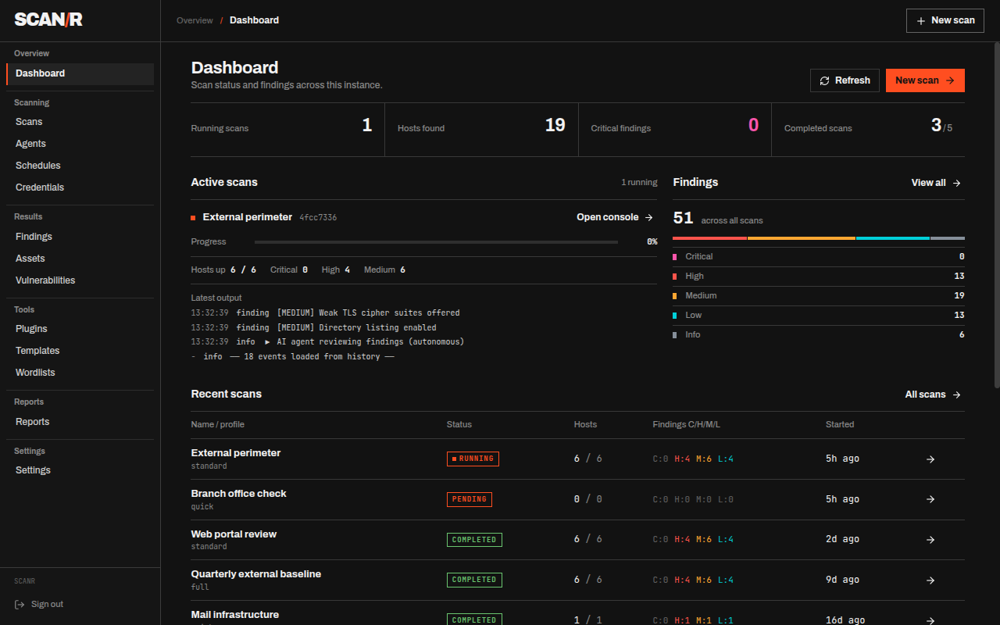

## Highlights

- **Template-assisted scanning** - start from intent-based presets, then tune the actual capabilities.
- **Context-aware targets** - internal, external, or custom context with automatic target handling for IPs, CIDR blocks, IP ranges, hostnames, and domains.
- **Capability controls** - discovery, ports, service/web enumeration, depth, safety, and performance are exposed directly.
- **Nmap, masscan, Nuclei, and native plugins** - host discovery, port scanning, service detection, CVE checks, web checks, TLS checks, vulnerable JS library detection (retire.js-style), and service misconfiguration checks.
- **Live console and persisted history** - stream scan progress while the scan runs and replay it later.
- **Findings triage** - false positive, accepted risk, analyst notes, compliance tags, MITRE ATT&CK tags, and evidence.
- **Retest** - re-run one finding's check against its original target and record the verdict, so a remediation cycle does not need a full rescan. Keeps a dated history per finding.
- **Peer-review evidence** - findings can include command/probe evidence so another tester can validate the result.
- **Screenshots** - Playwright captures discovered web services when enabled.
- **Attack paths** - ranked routes from the attacker's position to a domain or privileged objective, built from findings rather than guesswork, with chokepoint analysis showing which single fix breaks the most routes.
- **Scan deltas** - compare scans to see new, resolved, and persisting findings, plus host/port changes.
- **Templates and schedules** - save reusable scan profiles and run them on a schedule.
- **Reports** - export executive and technical reports as HTML, PDF, JSON, CSV, BloodHound JSON, or **SARIF 2.1.0** for GitHub code scanning, DefectDojo and other DevSecOps pipelines.
- **TOPdesk integration** - file a finding as a TOPdesk incident, deduplicated so a re-scan links the existing ticket instead of opening a second one.
- **CI/CD gate** - `scanr ci` blocks on a scan, writes SARIF, and exits non-zero above a severity threshold; a reusable GitHub Action uploads results to code scanning.
- **API keys, webhooks, and agents** - integrate ScanR into automated workflows and scan from different network vantage points.
- **AI-augmented pentesting (optional)** - findings summaries, report narratives, and false-positive testing, plus a gated guided/autonomous agent that actively investigates a scan (with an optional sandboxed shell). Conversational with follow-ups and mid-chat model switching. Bring your own ChatGPT, DeepSeek, or Anthropic key.

## Screenshots

### Scan Management

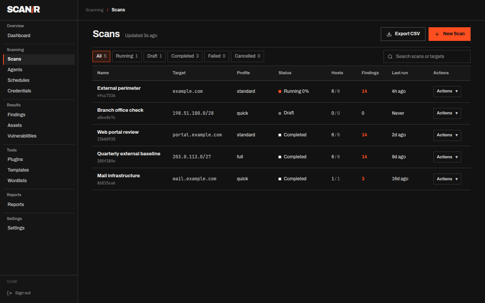

Click any row to open that scan's live console: every discovery, port, and
finding event streams in as it happens and is kept for replay.

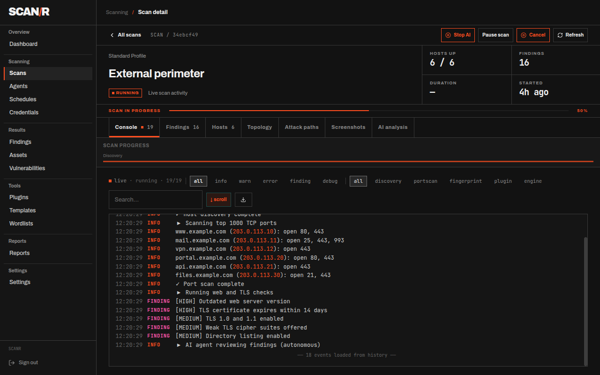

### New Scan Flow

Start from a template, then adjust anything before launch.

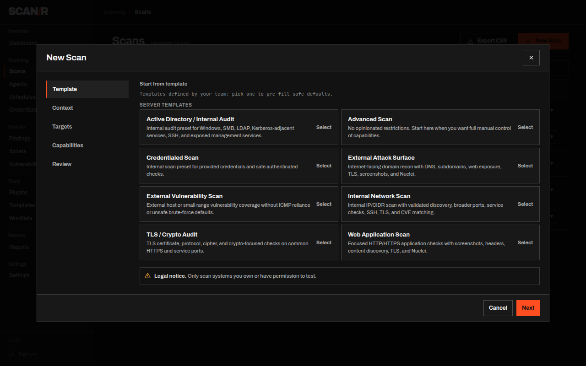

Targets are previewed before launch so a tester can see how ScanR interprets each line.

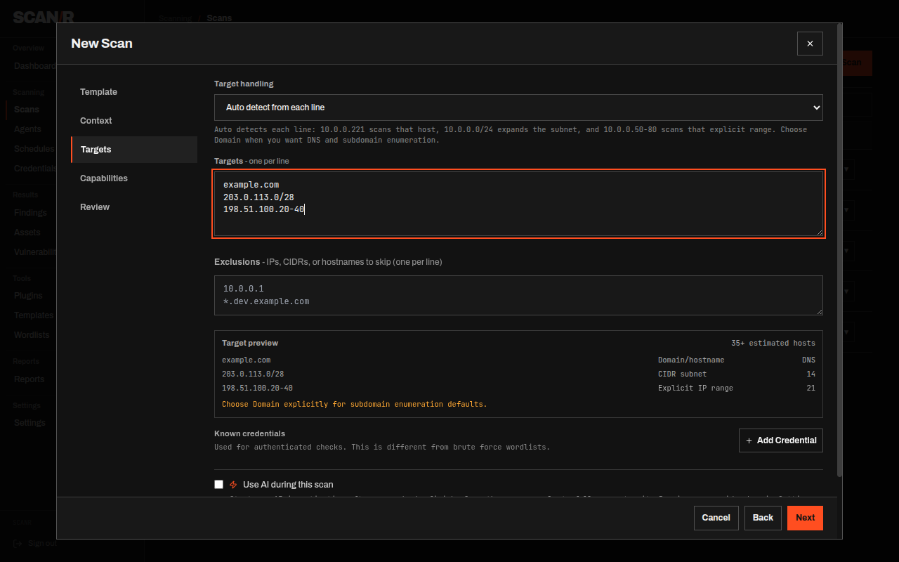

Capabilities are grouped by discovery, ports, enumeration, safety, and performance.

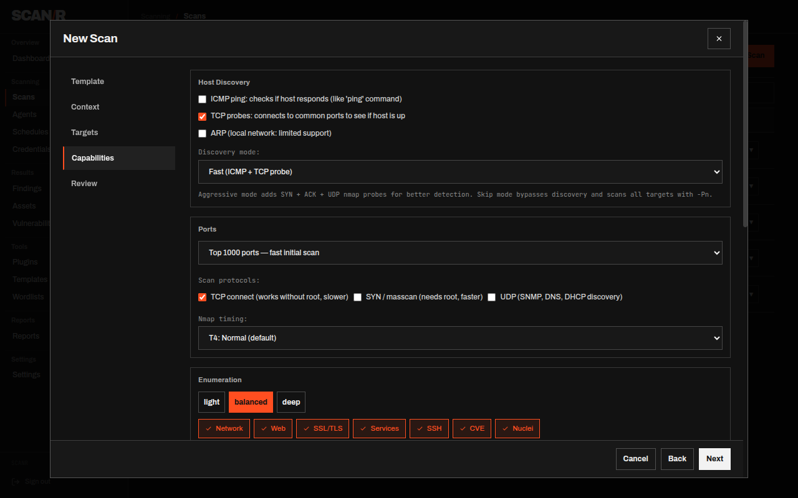

The review step summarizes scope, selected capabilities, credentials, warnings, and skipped/conditional checks before creating a pending scan.

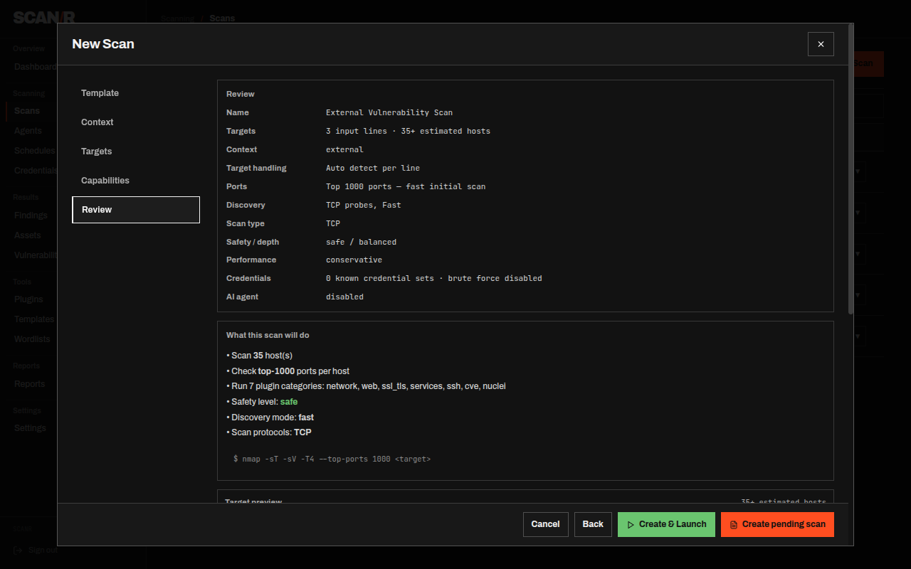

### Findings

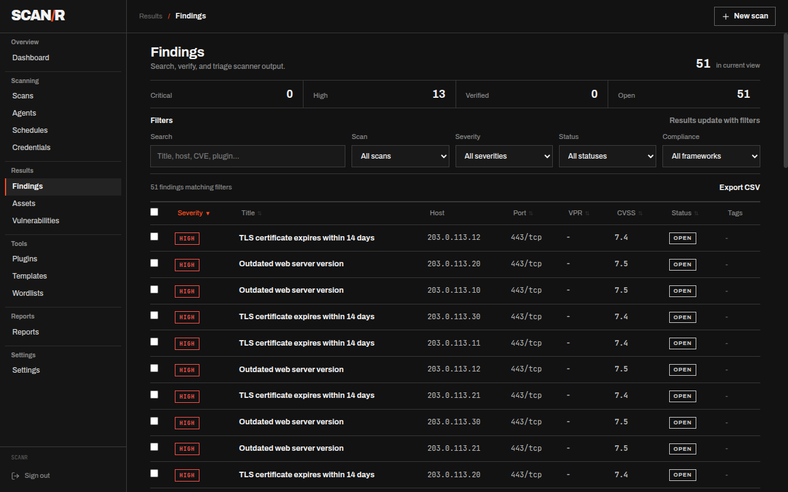

### AI Agent Workspace

The **AI analysis** tab gives each scan a full agent workspace: session history,
the conversation with every tool call's command and result, and a Stop control
that is always visible.

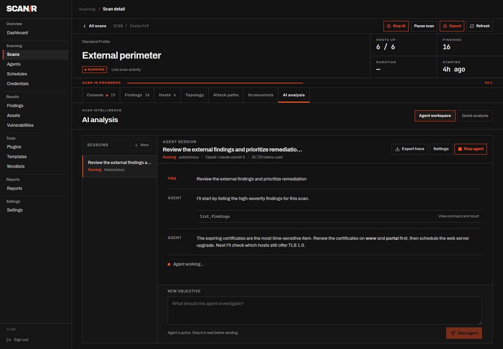

### Retest

A client says "fixed". Retest re-runs **only that finding's plugin** against the
same host and port, and records what it concluded — no full rescan required. Each
attempt is kept, so a finding carries a dated trail: *still present on the 12th,
verified fixed on the 3rd*.

Verdicts are deliberately conservative, because "resolved" is a claim someone acts
on by closing the ticket:

| Verdict | Meaning |
|---|---|
| `still_present` | The check ran and reported the same issue. |
| `resolved` | The check ran against a reachable host and no longer reports it. |
| `inconclusive` | The host did not answer. **Not** remediation — a box switched off during the retest window has not been fixed. |

A plugin that crashes records a failure, never a verdict.

```bash
curl -X POST -H "X-API-Key: sk_..." http://localhost:8000/api/v1/findings/<id>/retest
curl -H "X-API-Key: sk_..." http://localhost:8000/api/v1/findings/<id>/retests
```

Requires the `findings:triage` scope rather than `findings:read` — a retest sends
live traffic to the target.

### CI/CD

`scanr ci` runs a scan to completion and turns the result into an exit code, so a
pipeline can gate on it:

```bash
export SCANR_URL=https://scanr.internal
export SCANR_TOKEN=sk_...          # API key: scans:write, findings:read, reports:read/create

scanr ci --target 192.0.2.0/24 --fail-on high --sarif scanr.sarif
```

| Exit | Meaning |
|---|---|
| `0` | Scan completed, nothing at or above `--fail-on` |
| `1` | Scan completed, findings at or above `--fail-on` |
| `2` | No verdict — API error, timeout, or the scan failed |

`1` and `2` are deliberately distinct: a broken scanner must not be
indistinguishable from a clean report. `--fail-on never` gives report-only mode
for teams adopting the gate before enforcing it. A SARIF write failure never
changes the verdict — the scan already ran.

The CLI verifies the API's TLS certificate. Every request carries your API key,
and the `ci` verdict is something a pipeline acts on, so neither should travel
over a connection an interceptor can read or forge. A ScanR behind a private CA
or a self-signed certificate needs `--insecure` (or `SCANR_INSECURE=1`) — prefer
trusting the CA on the runner where you can.

**GitHub Action:**

```yaml
permissions:
  contents: read
  security-events: write   # required for the code-scanning upload

steps:
  # Pin a release tag or, for maximum supply-chain stability, a full commit SHA.
  - uses: T3rr0or/ScanR/.github/actions/scanr-scan@v0.22.0
    with:
      url: ${{ secrets.SCANR_URL }}
      token: ${{ secrets.SCANR_API_KEY }}
      targets: |
        staging.example.com
        192.0.2.0/24
      fail-on: high
```

Findings land in the repository's **Security → Code scanning** tab, deduplicated
across runs by the SARIF fingerprints, and the SARIF is uploaded even when the
build fails so the results are visible either way.

### TOPdesk

Findings can be filed straight into TOPdesk as incidents, so remediation is
tracked where the service desk already works.

Configure it under **Settings → Integrations** (admin only): instance base URL,
username, and a TOPdesk **application password** — the per-integration credential
TOPdesk issues under a user's settings, not an operator's own password. It is
stored Fernet-encrypted and never returned by the API. *Test connection* makes one
authenticated call so setup is confirmed there rather than discovered on first use.

**Filing is idempotent.** Each incident is stamped with
`externalNumber = scanr:<fingerprint>`, using the same plugin + host + port + title
identity as the SARIF export. Before creating anything, ScanR searches TOPdesk for
that number and adopts an existing incident if one is found — so pressing the
button twice, restoring a database, or running a second ScanR instance links the
same ticket instead of opening duplicates. The response says whether it created or
adopted.

Instance-specific fields (category, subcategory, call type, operator group,
caller, priority names) come from an optional JSON defaults blob. Anything left
unset is omitted rather than guessed, because an incident filed under the wrong
taxonomy is one the service desk has to re-file by hand.

```bash
curl -X POST -H "X-API-Key: sk_..." \
  http://localhost:8000/api/v1/integrations/topdesk/findings/<finding-id>/ticket
```

Requires `findings:triage` — it writes to a system outside ScanR.

### Attack Paths

Findings sorted by CVSS say which issue is worst in isolation. The Attack Paths
tab answers a different question: which chain of issues actually reaches something
that matters, and what single fix breaks the most chains.

Each route is a sequence of attacker steps — initial access, credential access,
lateral movement, privilege escalation, domain compromise — and **every step cites
the finding that justifies it**. Routes are ranked by attacker effort rather than
hop count, so a two-hop chain through unauthenticated criticals outranks a one-hop
chain through a theoretical info leak.

The graph is **evidence-only by default**: every edge cites a finding. Findings
marked false positive are excluded.

Credential reuse is available as a reasoned step — a credential obtained on one
host is worth trying against any host exposing an authentication service the scan
observed — but it is **opt-in** (`include_inferred=true`), on measurement. Being
credentials × hosts, it dominated the graph it was added to: 92% of all edges on
a 1000-host scan, and 1.6M edges / 833MB peak on a 4000-host one. Against that,
no ranked path ever used an inferred edge — priced above every demonstrated step
by design, they never win where a real route exists. Turn it on for a sparse scan
where nothing else connects; leave it off otherwise. Inferred steps are labelled
`inferred` everywhere they appear, and capped either way.

Large graphs are trimmed for transport (`truncated: true`, with `totals` giving
the real counts). Ranked paths are never trimmed.

Because the default excludes hypotheses, a scan whose only route was inference
now shows no paths. That is correct but easy to misread, so when the
evidence-only graph finds nothing the response carries
`inferred_paths_available`: how many routes appear with reuse assumed (`0` means
nothing connects at all). The UI turns that into "N likely routes — show them"
rather than an empty panel.

```bash
curl -H "X-API-Key: sk_..." \
  "http://localhost:8000/api/v1/scans/<scan-id>/attack-paths?include_inferred=true"
```

### Templates

Templates are presets, not hard modes. Users can edit context, target handling, ports, discovery, enumeration, safety, and performance before launch.

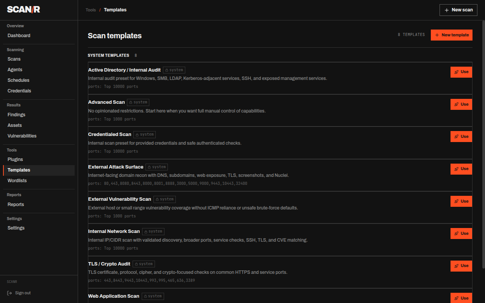

### Plugins, Reports, and Wordlists

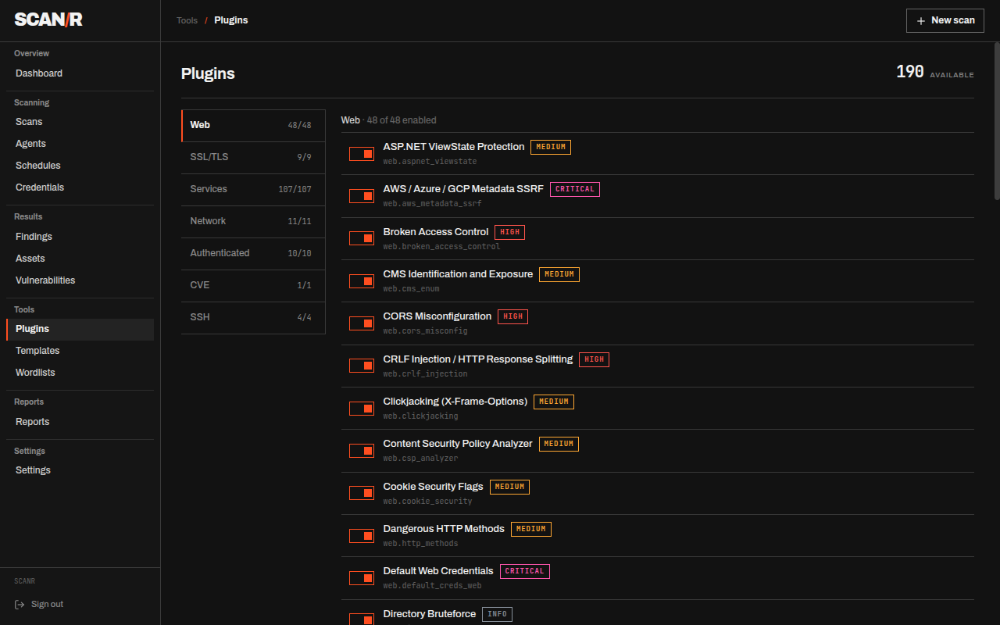

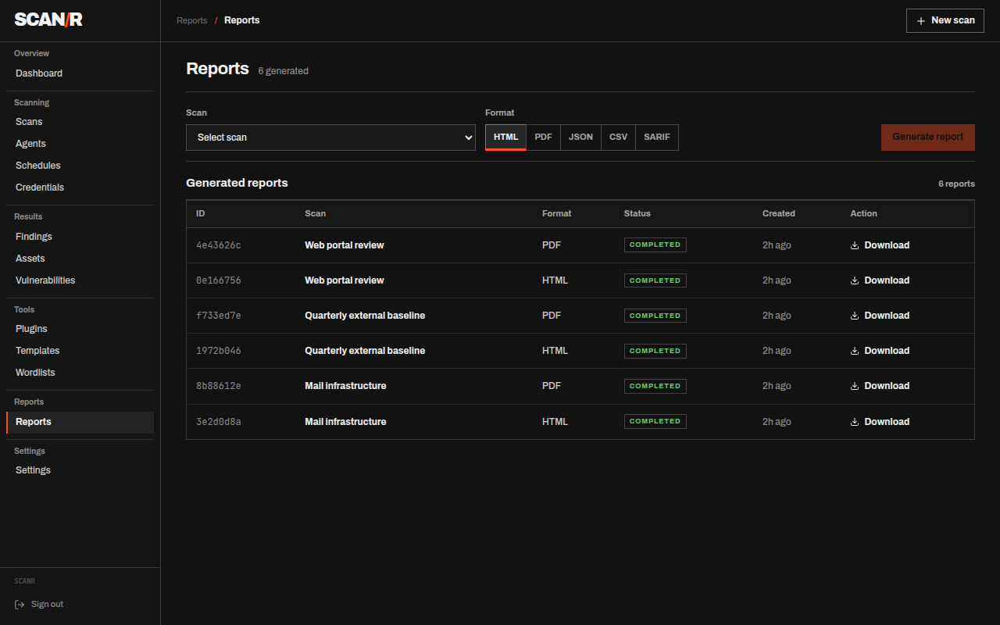

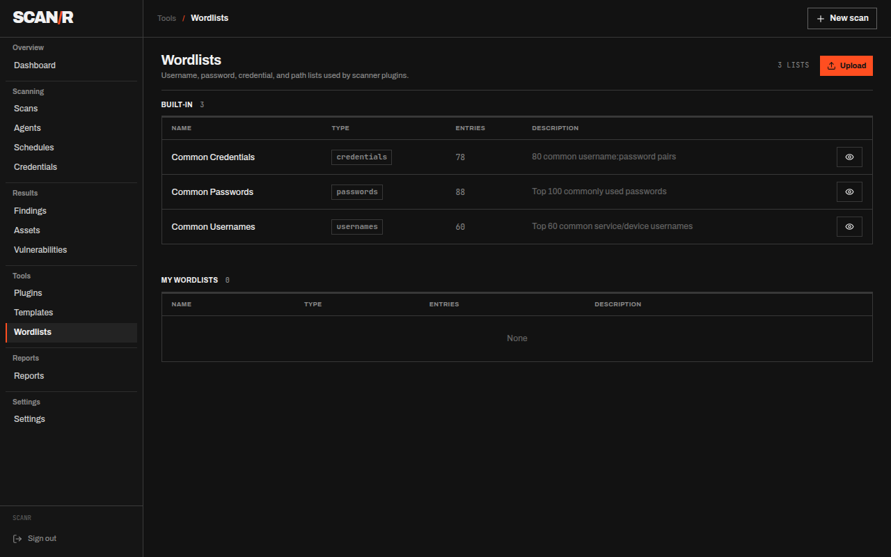

All screenshots use documentation-safe demo data: `example.com` hosts and the
`203.0.113.0/24` and `198.51.100.0/24` documentation ranges.

---

## Quick Start

### Prerequisites

- Docker Engine 24+
- Docker Compose v2 (`docker compose`)
- Git and Python 3.10+ (for the setup helper; no packages needed)
- Ports `80` and `8000` available on the host loopback interface

### 1. Clone

```bash
git clone https://github.com/T3rr0or/ScanR.git
cd ScanR
```

### 2. Configure and start

Run the setup helper with Python 3.10+ (standard library only):

```bash
python3 scripts/setup.py --admin-email you@example.com --start
```

It creates a private `.env`, generates all six required secrets, validates the
Compose configuration, pulls the application and sandbox images, and waits for
services to start. No Python packages or manual key-generation commands are
needed. The initial admin password is stored in `.env`; open that file locally
to retrieve it. Keep it private and backed up, especially `VAULT_KEY`, which is
needed to decrypt saved credentials.

To review configuration before starting, omit `--start`. Running with `--start`
again reuses the existing `.env` without changing credentials. For an HTTPS
reverse proxy, add `--origin https://scanr.example.com` on the first run and
configure the proxy as described below. Setup does not configure TLS for you.

If you prefer manual configuration, copy `.env.example` to `.env` and set
`SECRET_KEY`, `VAULT_KEY`, `POSTGRES_PASSWORD`, `ADMIN_PASSWORD`, `SANDBOX_TOKEN`,
and `BROWSER_SERVICE_TOKEN`. Compose rejects empty required secrets.

Services:

- **frontend** - React/Vite app served by Nginx on loopback port `80`
- **api** - FastAPI backend on loopback port `8000`
- **scan-worker** - scanner and retest queue; target egress, no AI/provider or
  sandbox credentials
- **ai-worker** - guided/autonomous agent queue; the only application service
  allowed to call the Docker-backed sandbox runner
- **control-worker** - reports, schedules, watchdogs, and Celery beat; no target
  egress or vault/provider credentials
- **browser** - authenticated, secret-free Chromium renderer for hostile targets
- **postgres** - application database
- **redis** - task queue, result backend, and event bus
- **sandbox-runner** - AI agent command-execution sandbox
- **sandbox-proxy** - per-run filtered mirror egress (image built/published but
  never started as a shared Compose service)
- **sandbox-relay** - per-run SOCKS5 relay giving one sandbox scope-limited
  target access (image built/published; started only when opted in)

First boot runs migrations and seeds system templates/plugins.

For local development from source:

```bash
docker compose --profile build-only build   # or: make docker-build
docker compose up -d
```

The `build-only` profile carries **sandbox-proxy** and **sandbox-relay**. The
runner spawns one of each per agent run through the Docker API, so Compose never
starts shared instances — but a plain `docker compose build` skips profiled
services, and both images must exist before an agent can start a shell session.

### 3. Open

Open **http://localhost** and sign in with the admin email you passed to
setup (default `admin@example.com`). The generated password is in `.env`:

```bash
grep '^ADMIN_PASSWORD=' .env
```

Change it after the first sign-in under **Settings → Profile**.

This plaintext URL is for same-host access only. Both published ports bind to
`127.0.0.1` by default.

### Production / network access: terminate HTTPS

Keep `SCANR_UI_BIND=127.0.0.1`, run a TLS reverse proxy on the same host, and
forward it to `127.0.0.1:80`. For example, a minimal Caddy site is:

```caddyfile
scanr.example.com {
    reverse_proxy 127.0.0.1:80
}
```

Then configure the browser-facing origin without weakening cookie transport:

```dotenv
ALLOWED_ORIGINS=https://scanr.example.com
SECURE_COOKIES=true
DEVELOPMENT_MODE=false
```

The frontend emits HSTS when served through that TLS edge. Do not expose port
80 on a LAN or Tailscale network and do not disable secure cookies for a
production deployment. If local HTTP development genuinely needs non-secure
cookies, set `DEVELOPMENT_MODE=true` and `SECURE_COOKIES=false` explicitly; the
application refuses the latter setting on its own.

---

## Scan Workflow

### 1. Pick a Template

Templates are entry points only. They preconfigure options but do not hide or lock capabilities.

Common template intents:

- **External Attack Surface** - domains, DNS, subdomains, and web exposure.
- **Web Application Scan** - HTTP/HTTPS ports, headers, screenshots, Nuclei, and web checks.
- **External Vulnerability Scan** - internet-facing hosts with TCP-based discovery defaults.
- **Internal Network Scan** - internal CIDR/range discovery and service enumeration.
- **Credentialed Scan** - internal scan prepared for supplied credentials.
- **Active Directory / Internal Audit** - Windows and internal service-oriented checks.
- **TLS / Crypto Audit** - certificates, protocols, ciphers, and TLS findings.
- **Advanced Scan** - minimal assumptions, full manual control.

### 2. Set Context

`scan_context` sets defaults only:

- **Internal** - deeper enumeration, internal protocols, ICMP/ARP-style intent, and internal service defaults.
- **External** - avoids ICMP reliance, uses TCP/DNS/web-focused defaults.
- **Custom** - neutral defaults with all controls editable.

### 3. Enter Targets

Target handling defaults to **Auto detect from each line**:

| Input | Meaning |
|---|---|
| `192.0.2.24` | one exact IP host |
| `192.0.2.0/24` | CIDR subnet |
| `192.0.2.50-80` | explicit IP range |
| `demo.internal` | hostname |
| `example.com` | domain/hostname; choose Domain for DNS/subdomain workflows |

ScanR shows a target preview with estimated host counts before the scan is created.

### 4. Tune Capabilities

Capability groups:

- **Host Discovery** - ICMP, TCP probes, ARP intent, assume-up behavior, retries, and discovery strategy.
- **Ports** - top ports, full range, web ports, internal high web/NodePort preset, custom ranges, scanner type.
- **Enumeration** - service detection, HTTP probing, TLS checks, security headers, screenshots, Nuclei, directory enumeration, subdomains, DNS recon.
- **Depth** - light, balanced, or deep.
- **Safety** - safe, balanced, or aggressive. `safe` excludes every check that
  sends attack traffic — SQLi, XSS, SSTI, XXE, traversal, JNDI, deserialization,
  request smuggling, and default-credential attempts — leaving observation and
  fingerprinting. `balanced` and `aggressive` both permit them.
- **Performance** - conservative, normal, fast, or custom concurrency/rate/timeout settings.

### 5. Review and Launch

The final review step shows:

- interpreted targets and estimated host count
- context and target handling
- selected ports and discovery methods
- safety, depth, and performance
- known credentials and brute-force status
- enabled capability groups
- warnings and skipped/conditional checks

Creating a scan produces a **pending** scan. Review it, then launch it from the Scans table.

---

## Results and Triage

Open a scan to review:

- **Console** - live scan stream and persisted history.
- **Findings** - sortable/filterable findings with severity, host, port, plugin, evidence, remediation, compliance, and MITRE tags.
- **Hosts** - discovered hosts, open ports, service versions, and OS guesses.
- **Topology** - network visualization.
- **Screenshots** - web screenshots captured by Playwright.
- **Chains** - relationship view for correlated findings where available.

Triage actions:

- mark false positive
- accept risk
- add analyst notes
- track remediation status
- compare against previous scans to identify new/resolved findings

---

## Plugin Categories

| Category | Examples |
|---|---|
| Web | HTTP headers, CORS, clickjacking, directory brute-force, sensitive files, open redirect, path traversal, JWT, GraphQL, screenshots |
| SSL/TLS | Certificate inspection, cipher audit, protocol checks, Heartbleed, POODLE/BEAST |
| SSH | Algorithm audit, version fingerprinting, default credential checks |
| Services | FTP, SMB, SNMP, Redis, MongoDB, Elasticsearch, Docker, Kubernetes, Jupyter, IPMI, NTP, VNC, Telnet, RDP |
| Network | Host/port inventory, ICMP information, NetBIOS |
| CVE | NVD-based matching against detected product/version data |
| Nuclei | ProjectDiscovery Nuclei templates for CVEs, exposures, misconfigurations, and default logins |

---

## Credentials and Wordlists

ScanR separates credential concepts:

- **Known credentials** are supplied to authenticated checks.
- **Brute force wordlists** actively try username/password lists against detected services when enabled.

Balanced and aggressive safety both allow intrusive checks; `safe` is what turns
them off. Brute force is separate from all three — it always requires the
brute-force capability to be enabled explicitly.

A plugin declares its own risk, and two gates read it: `intrusive` (sends attack
payloads) drops the check from a `safe` scan, and `destructive` (can modify the
target — write a file, rebind a config, affect another user's request) also
requires the AI agent's `allow_exploitation` capability before the agent may run
it.

---

## Reports

Reports can include:

- executive summary
- affected assets
- severity breakdown
- full finding details
- evidence and remediation
- compliance tags
- analyst notes

Formats: **HTML**, **PDF**, **JSON**, **CSV**, **BloodHound JSON**, and
**SARIF 2.1.0**.

SARIF is the interchange format GitHub code scanning, DefectDojo and Azure DevOps
ingest natively, so a scan's findings can land in an existing triage queue rather
than a PDF someone has to read. ScanR's output is validated against the official
2.1.0 schema in CI, and each result carries a `partialFingerprints` entry derived
from plugin + host + port + title — so a consumer recognises the same finding
across re-scans instead of treating every run as a fresh set of alerts.

```bash
curl -X POST -H "X-API-Key: sk_..." -H 'Content-Type: application/json' \
  -d '{"scan_id":"<scan-id>","format":"sarif"}' \
  http://localhost:8000/api/v1/reports
```

---

## AI features

ScanR can use an LLM to augment a scan. AI is **off unless you configure a
provider key**. Enter a key two ways:

- **In the web app** (recommended): **Settings → AI providers** — paste a key for
  Anthropic, OpenAI, or DeepSeek and pick the default provider. Keys are
  encrypted at rest (Fernet, requires `VAULT_KEY`) and never shown again.
- **Via environment**: set `ANTHROPIC_API_KEY`, `OPENAI_API_KEY`, or
  `DEEPSEEK_API_KEY` and `AI_PROVIDER`. A key entered in the web app overrides
  the environment value.

The Docker image bundles the provider SDKs; for a source install add the AI
extra (`pip install -e "backend[ai]"`). The base install runs fine without them.

**Quick analysis (read-only):** open a scan, choose **AI analysis → Quick
analysis**, or call the API directly.

- **Findings summary** - executive + technical narrative of a scan's findings:
  `POST /api/v1/scans/{scan_id}/summary`.
- **Report narrative** (API only) - structured engagement-report sections
  (executive summary, risk assessment, key findings, prioritized remediation):
  `POST /api/v1/scans/{scan_id}/report`.
- **False-positive testing** - the model reviews each finding's evidence and
  flags the ones likely to be false positives, with confidence and a reason, for
  analyst review (nothing is auto-hidden):
  `POST /api/v1/scans/{scan_id}/false-positives`.

`GET /api/v1/ai/status` reports which providers are configured.

Assist mode only reasons over results ScanR already collected — it never sends
new traffic to your targets, and finding text is passed to the model as fenced,
untrusted data (never as instructions).

### AI agent (guided / autonomous)

The scan's **AI analysis → Agent workspace** can run an **agent** that actively investigates the
scan: it drives a bounded, gated tool set, reasons about what it finds, and
writes a prioritized assessment. Launch it with an optional objective and a mode:

- **Guided** — investigates and pauses for operator approval before any
  intrusive action; the run surfaces the pending action with Approve / Deny in
  the AI tab (decision signalled to the running agent, which times out to deny).
- **Autonomous** — runs hands-off within scope and capability limits until it
  finishes or you stop it.

**Use AI during the scan.** You can also enable the agent when *creating* a
scan ("Use AI during this scan", with mode/objective and admin-gated aggressive
opt-ins). The scan engine then runs the agent at the enumeration phase boundary
— once hosts, services, and findings exist — so the AI performs high-value
follow-up checks (targeted plugins / port scans) that become part of the scan,
rather than requiring a manual launch afterward. The same safety gating applies.
While the scan runs, **Stop AI** in the scan header stops that agent — or
cancels it before it starts — without stopping the scan.

Safety is enforced in code, not by the model: every tool call is scope-checked —
targets are confined to the scan's own targets and discovered hosts, and
forbidden infra (loopback / link-local / metadata / scanner) is always blocked —
aggressive capabilities each require their own opt-in, an optional per-minute
token rate cap (`AI_RATE_LIMIT_TOKENS_PER_MIN`) paces provider calls, and every action (with its full arguments)
is streamed to the scan console and persisted for audit.

Runs have no step or session-token cap: an agent keeps working until it
finishes its assessment or you press **Stop agent**. Stop takes effect during a
slow model call or a rate-limit pause too, and tool calls the model requested
after you pressed it are not run. The partial transcript is kept, and you can
continue a stopped session by sending another message.

Tools available to the agent today: read the scan's hosts/findings/evidence,
`create_finding` (record what it discovers), `fetch_url` (HTTP GET,
non-intrusive), `list_plugins`, `run_plugin` (run a ScanR plugin against a
discovered host), `run_port_scan` (nmap a host), `submit_form` (HTTP POST —
intrusive, aggressive-gated), `browser_validate` (prove it in a real browser —
see below), `run_command` (sandboxed shell — see below), and the
working-memory/skill tools described below.
Active tools are intrusive, so they are approval-gated in guided mode. Pages the
agent fetches with `fetch_url` are also screenshotted into the Screenshots tab,
so its discoveries are captured visually alongside the scan's.

**Proving findings.** `browser_validate` loads a payload URL in a real headless
Chromium with JavaScript enabled and reports whether it *executed* — the
difference between a reflected parameter (the most common false positive in web
scanning) and an actual client-side vulnerability. The agent writes the payload
but not the marker: it puts the literal `{CANARY}` where a token belongs, e.g.
`http://10.0.0.5/search?q=<script>alert('{CANARY}')</script>`, and ScanR
substitutes an unguessable token it generated. Only that token coming back
through a JS channel — a dialog or the console — counts as proof, so the agent
cannot manufacture one.

Each attempt is bounded — per-call timeouts plus a 60-second wall-clock cap — and
concurrency is limited, because a hostile page chooses how long it holds you: a
JS loop pins a core for as long as it is allowed to. The cap makes one attempt
survivable; the concurrency limit stops it being multiplied.

Production rendering runs in a dedicated sidecar that receives no database,
Redis, JWT, vault, AI-provider, or sandbox credentials. Scan and AI workers call
it over an internal authenticated network; Chromium and its application code do
not run in those secret-bearing processes.

`BROWSER_VALIDATION_CONCURRENCY` (default `2`) is a sidecar-wide Chromium launch
ceiling. `BROWSER_REQUEST_LIMIT` (default `8`) also bounds requests queued by
Uvicorn before they can accumulate request bodies or temporary screenshots. A
hostile page can still pin one core for the full attempt cap, so tune the launch,
memory, and CPU limits to the host rather than increasing them with Celery
concurrency.

Verdicts are `proved`, `reflected`, `not_reproduced`, and `inconclusive` (the
page would not load — never reported as clean, for the same reason an
unreachable host is not "remediated"). A `proved` result stamps `validated` on
the finding along with the method and the evidence, clears any false-positive
mark, and captures a screenshot into the Screenshots tab. Verified findings
carry a badge in the UI and the HTML/PDF report, a `validated` tag in the SARIF
export, and a `validated` column in the CSV; filter for them with
`GET /api/v1/findings?validated=true` or **Verified only** in the Findings
filter. Nothing else sets the flag — not a model asserting it, not an analyst
ticking a box — which is what makes it worth filtering on.

**Working memory.** The agent keeps a plan and durable notes on the run
(`todo_write` / `todo_read`, `note_write` / `note_read`, plus `think` for
reasoning without acting). A long run's early turns fall out of the model's
context window; the plan and notes do not, so it stops re-deriving what it
already established. Both are persisted on the run, survive a restart, and are
included in the exported markdown trace — you can see what the agent intended
and what it believed, not just the calls it made.

**Skills.** Procedural expertise ships as markdown in
`backend/scanr/ai/skills/` — Active Directory, web authentication, TLS triage,
pivoting, and deciding whether a finding is real. Only the one-line index sits
in the system prompt; the agent pulls a full body with `load_skill` when it hits
that ground, so methodology it doesn't need costs nothing per turn. Adding a
skill is dropping in a `.md` file with a `name`/`description` header — no code
change.

The agent is **conversational**: after a run finishes you can send follow-up
messages to continue it (the full transcript is kept), and switch the model
mid-conversation — e.g. start on Claude, continue on DeepSeek. Replies render as
markdown in the AI tab.

**Aggressive capabilities** (admin-only opt-in at launch): enabling *aggressive*
unlocks intrusive/destructive actions; *allow exploitation* lets the agent run
destructive plugins via `run_plugin`, and *allow privilege escalation* is a
further opt-in. Each takes effect only with aggressive enabled, requires an
admin user, and is recorded on the run. Only use against systems you are
authorized to actively exploit.

`POST /api/v1/ai/scans/{scan_id}/agent` launches a run;
`GET /api/v1/ai/scans/{scan_id}/agent/runs` and `GET /api/v1/ai/agent/runs/{id}`
read them.

The autonomy levels (`off → assist → guided → autonomous → autonomous +
aggressive`) and the full safety model are documented in
[`docs/ai-pentest-design.md`](docs/ai-pentest-design.md).

Providers are swappable per request (ChatGPT/OpenAI, DeepSeek, Anthropic), so
you can run a cheap model for high-volume work and a stronger one for analysis.

### AI command-execution sandbox

The sandbox gives the AI agent a real shell (`run_command`) inside an isolated,
disposable container with the full pentest toolkit. It is **on by default** and
**fail-closed**: if the sandbox-runner is unreachable, `run_command` returns
"sandbox not configured" instead of falling back to something less safe.

**Required tokens:** set independently generated `SANDBOX_TOKEN` and
`BROWSER_SERVICE_TOKEN` values in `.env`. Compose refuses empty values.

```bash
# Generate a token and add it to .env:
printf 'SANDBOX_TOKEN=%s\n' "$(openssl rand -hex 32)" >> .env
printf 'BROWSER_SERVICE_TOKEN=%s\n' "$(openssl rand -hex 32)" >> .env
docker compose up -d
```

**Verify:** `docker compose exec ai-worker printenv SANDBOX_RUNNER_URL` should
print `http://sandbox-runner:8090`.

**Disable command execution:** `docker compose stop sandbox-runner`. The
AI worker fails closed when the runner is unavailable. There is no shared proxy
to stop: the runner creates and destroys an isolated proxy/network for each run.

**What the shell can reach.** Two levels, both opt-in and admin-only:

| | Package mirrors | Scan targets |
|---|---|---|
| `allow_command_exec` only (default) | yes, via allowlisting proxy | **no route at all** |
| `+ allow_target_egress` | yes | this scan's authorized scope only |

Without target egress the sandbox is for local work — analysing collected data,
offline cracking, generating payloads, building tooling — and the agent reaches
targets through the scope-checked `run_port_scan` / `run_plugin` / `fetch_url` /
`submit_form` tools instead.

With it, the runner starts a per-run SOCKS5 relay carrying that scan's scope. It
refuses every other destination, re-checks loopback / cloud metadata /
infrastructure, and validates the *resolved* address, so a hostname can't be used
to escape scope. Inside the sandbox, reach targets via `$ALL_PROXY`
(`proxychains nmap -sT -Pn <target>`, `curl --socks5-hostname`). Raw-socket scans
(`-sS`) don't work through a TCP relay — the container is non-root anyway, so it
was always TCP-connect only.

To use `run_command` in a scan, you must also enable **"Allow command
execution"** when launching the AI agent (admin-only aggressive opt-in).

Isolation model: only a dedicated **sandbox-runner** holds the Docker socket and
it carries **no ScanR application secrets**; only the AI worker can reach its
authenticated control network, and that worker cannot touch the socket. The
agent gets **one persistent, hardened container per run** (state
persists across commands) that is non-root, read-only-rootfs, `cap-drop ALL`,
and resource/time-limited, on its own `internal` Docker network with no route
anywhere by default. A separate allowlisting proxy is created on that network
and destroyed with the run, so sandboxes never share an L2 segment. The path is
**fail-closed** — if the runner is unavailable, command execution is denied —
and `run_command` requires admin + the aggressive `allow_command_exec` opt-in.

Two levels of network reach, both narrow:

- **Package mirrors only (default).** The sandbox can `pip`/`apt` install through
  an allowlisting proxy, but has no route to any scan target. Good for local work:
  analysis, offline cracking, payload generation, tooling.
- **Scan targets (opt-in, `allow_target_egress`).** The runner starts a per-run
  SOCKS5 relay holding that scan's authorized scope. It refuses every other
  destination, re-checks loopback/metadata/infrastructure, and validates the
  *resolved* address — so a hostname cannot be used to escape scope. Tools reach
  targets through `proxychains` / `--socks5-hostname`; use TCP connect scans
  (`-sT`), as a TCP relay cannot carry raw-socket scans.

Chosen over per-run firewall rules deliberately: rules would need `NET_ADMIN` and
host networking on the Docker-socket holder, and a rule that failed to apply would
fail *open*. Full architecture and rationale:
[`docs/ai-sandbox-design.md`](docs/ai-sandbox-design.md).

---

## Scheduled Scans

Use **Schedules** to run recurring scans from saved templates. Schedules use cron syntax, for example:

```text
0 2 * * 0
```

That example runs weekly at 02:00.

---

## API Access

Create an API key in **Settings** and call the API:

```bash
curl -H "X-API-Key: sk_..." http://localhost:8000/api/v1/scans
```

Create a pending scan:

```bash
curl -X POST http://localhost:8000/api/v1/scans \
  -H "X-API-Key: sk_..." \
  -H "Content-Type: application/json" \
  -d '{
    "name": "Internal review",
    "targets": ["192.0.2.0/24"],
    "profile": "custom",
    "profile_json": "{\"scan_context\":\"internal\",\"port_range\":\"top-1000\"}"
  }'
```

### API key scopes

Scopes are checked per endpoint. Two are worth calling out because they changed:

| Scope | Covers |
|---|---|
| `reports:read` | list, inspect, download an existing report |
| `reports:create` | generate a new report (spawns a background job) |
| `reports:export` | **deprecated** — still accepted, expands to `reports:read` + `reports:create`. New keys cannot be minted with it. |
| `ai:generate` | finding summaries, report narratives and false-positive testing; also requires `findings:read` |
| `ai:agent` | launch and control guided/autonomous agents; also requires `scans:write` |
| `ai:aggressive` | exploitation, command execution and target egress; also requires `ai:agent`, `scans:write`, and an admin owner |
| `ai:configure` | administer AI provider keys, defaults and model selection; admin owner only |
| `users:manage` | administer user accounts; admin owner only |
| `integrations:manage` | read/change global integration configuration; admin owner only |
| `system:manage` | update-status and CVE-feed administration; admin owner only |

> **Breaking change for existing keys.** AI generation used to be reachable with
> `findings:read`; it now requires both `findings:read` and `ai:generate`, and unlike `reports:export`
> there is deliberately **no alias** — read access should not imply the right to
> spend money on an upstream API. A key holding only `findings:read` will start
> getting `403` on `POST /api/v1/ai/scans/{id}/summary`,
> `POST /api/v1/ai/scans/{id}/report`, and
> `POST /api/v1/ai/scans/{id}/false-positives`. Add `ai:generate` to any key
> that needs them.

Admin role and API-key scopes are independent checks: an admin-owned key only
gets the privileges explicitly listed on that key. The `*` scope grants every
API-key scope, but intentionally does not grant session-only operations such as
in-process self-update or changing the owning account's profile/password.

Interactive API docs are available at **http://localhost:8000/docs** when
`DOCS_ENABLED=true`. They are unauthenticated and publish the full API surface, so
the Docker deployment ships with them **off**; set `DOCS_ENABLED=true` in `.env`
to turn them on. A local `make dev` run has them on by default.

---

## Configuration

| Variable | Default | Description |
|---|---:|---|
| `SECRET_KEY` | required | JWT signing secret |
| `PROCESS_ROLE` | `api` | Compose-managed runtime identity (`api`, `scan-worker`, `ai-worker`, or `control-worker`); only the API receives JWT/admin bootstrap secrets |
| `VAULT_KEY` | required by Compose | Fernet key for credentials and webhook signing secrets; startup/migration fails closed without it |
| `POSTGRES_PASSWORD` | required | PostgreSQL password |
| `ADMIN_EMAIL` | `admin@scanr.local` | Bootstrap admin email |
| `ADMIN_PASSWORD` | required | Bootstrap admin password |
| `ALLOWED_ORIGINS` | `http://localhost` | Comma-separated CORS origins |
| `SECURE_COOKIES` | `true` | Mark auth cookies as secure; `false` is rejected outside explicit development mode |
| `DEVELOPMENT_MODE` | `false` | Explicitly permits local HTTP-only development settings; never enable in production |
| `TRUSTED_PROXIES` | empty | Comma-separated proxy IPs/CIDRs allowed to set `X-Forwarded-For` for rate limiting |
| `SCAN_TARGET_DENYLIST` | infra defaults | Hostnames/IPs that can never be scanned (merged with built-in loopback/link-local/metadata denylist) |
| `SCAN_HEARTBEAT_TIMEOUT` | `300` | Seconds before a heartbeat-stale running scan is auto-failed |
| `AI_PROVIDER` | `anthropic` | Default AI provider: `anthropic`, `openai`, or `deepseek` |
| `AI_MODEL` | provider default | Override the model id used for AI features |
| `AI_MAX_TOKENS` | `2048` | Max output tokens per AI request |
| `AI_RATE_LIMIT_TOKENS_PER_MIN` | `0` | Per-minute input-token cap for agent runs (0 = no limit; the loop throttles to stay under it) |
| `ANTHROPIC_API_KEY` | empty | Key for the Anthropic provider (enables AI when set) |
| `OPENAI_API_KEY` | empty | Key for the OpenAI/ChatGPT provider |
| `DEEPSEEK_API_KEY` | empty | Key for the DeepSeek provider |
| `SANDBOX_RUNNER_URL` | empty | URL of the sandbox-runner; enables the agent's `run_command` shell when set (fail-closed if unset) |
| `SANDBOX_TOKEN` | empty | Shared token authenticating the worker to the sandbox-runner |
| `SANDBOX_NETWORK_PREFIX` | `scanr-sbx-net` | Prefix for the private internal network created for each agent run |
| `SANDBOX_PROXY_IMAGE` | built image | Filtering proxy image instantiated separately for every agent run |
| `SANDBOX_PROXY_PORT` | `8888` | Port of the run-local package-mirror proxy |
| `SANDBOX_MAX_SESSIONS` | 8 | Ceiling on live sandbox containers |
| `SANDBOX_RELAY_IMAGE` | built image | Image for the per-run SOCKS5 egress relay |
| `SANDBOX_IMAGE` | `ghcr.io/t3rr0or/scanr-sandbox:latest` | Toolkit image the sandbox runs |
| `SANDBOX_CMD_TIMEOUT` | `120` | Per-command timeout (seconds) in the sandbox |
| `BROWSER_SERVICE_TOKEN` | required by Compose | Dedicated token authenticating scan/AI workers to the isolated renderer |
| `BROWSER_VALIDATION_CONCURRENCY` | `2` | Sidecar-wide ceiling on concurrent Chromium launches |
| `BROWSER_REQUEST_LIMIT` | `8` | Uvicorn concurrency limit, including requests waiting for a renderer slot |
| `BROWSER_MEMORY_LIMIT` | `1g` | Browser sidecar container memory limit |
| `BROWSER_CPU_LIMIT` | `2.0` | Browser sidecar CPU limit |
| `SCAN_WORKER_CONCURRENCY` | `4` | Processes consuming only the `scan` queue |
| `AI_WORKER_CONCURRENCY` | `2` | Processes consuming only the `ai` queue |
| `CONTROL_WORKER_CONCURRENCY` | `2` | Processes consuming only the `control` queue; one also runs beat |
| `DATABASE_URL` | compose-managed | SQLAlchemy database URL |
| `REDIS_URL` | compose-managed | Redis URL |
| `CELERY_BROKER_URL` | compose-managed | Celery broker URL |
| `CELERY_RESULT_BACKEND` | compose-managed | Celery result backend |
| `SCANR_API_BIND` | `127.0.0.1` | Host bind address for direct plaintext API access |
| `SCANR_UI_BIND` | `127.0.0.1` | Host bind address for the plaintext frontend; keep loopback behind TLS |
| `WORDLIST_DIR` | `/app/wordlists` | Wordlist storage path |
| `SELF_UPDATE_ENABLED` | `false` | Enables admin-only in-app update when using the self-update Compose override |
| `SELF_UPDATE_COMMAND` | compose pull/up | Command run by the self-update action |
| `SELF_UPDATE_WORKDIR` | `/opt/scanr` | Directory where the self-update command runs |

---

## Architecture

```text
Browser
  |
  | HTTP / WebSocket
  v
Nginx frontend
  |
  v
FastAPI backend
  |-- PostgreSQL / Redis (private data network)
  |-- assist-mode provider calls (API egress only)
  |
  +-- scan queue --> scan-worker --> targets
  |                    |
  |                    +--> isolated browser sidecar --> targets
  |
  +-- ai queue ----> ai-worker ----> providers / targets
  |                    |  |
  |                    |  +--> isolated browser sidecar
  |                    +----> sandbox-runner (private control network)
  |                               |
  |                               +--> per-run sandbox + mirror proxy
  |                                    (+ scoped relay when opted in)
  |
  +-- control queue -> control-worker + beat (data network only)
```

---

## Updating

Updates are administrator-triggered. ScanR checks for releases, but does not
schedule or install them automatically. Let active scans and AI sessions finish
and back up the database and `.env` before updating.

From your installation directory, the setup helper also refreshes an existing
installation without replacing its configuration:

```bash
python3 scripts/setup.py --start
```

This pulls all configured images, including the per-run sandbox images, and
waits for services to start. It respects `SCANR_VERSION` in `.env`: a pinned tag
stays pinned until you change it. Check release notes for Compose/configuration
changes before upgrading; pulling images does not update checkout files.

Database migrations run automatically on API startup.

### In-app updates (optional)

Set `SELF_UPDATE_ENABLED=true` in `.env` and uncomment
`COMPOSE_FILE=docker-compose.yml:docker-compose.self-update.yml`. Then:

```bash
docker compose up -d
```

This enables the **Update now** button when a newer GitHub release is available.
The in-app updater runs inside the API container it replaces, so the final
restart ends the process running the update. The status shows `restarting` until
the replacement API responds, then reports success with the running version. If
the API restarts while images are still being pulled, the update is reported as
failed. If no replacement API comes up, the status stays `restarting` and expires
to failed after an hour; run the host-side command above and inspect
`docker compose ps`.

The self-update overlay mounts the host Docker socket and project directory into
the API container — use only for trusted admin deployments.

---

## Stopping

```bash
# Stop containers and keep data
docker compose down

# Stop and delete all ScanR data
docker compose down -v
```

---
